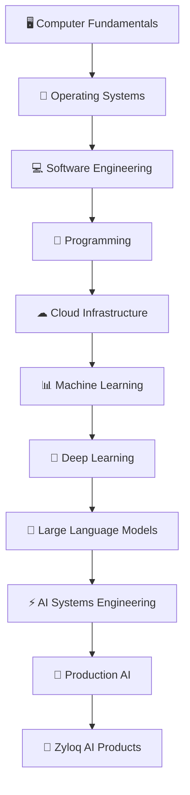

<div align="center">

# 🚀 Zyloq AI Engineering Academy

### *The official engineering onboarding and learning path for AI Engineers at Zyloq AI.*


---

### **Learn from First Principles • Build Production AI Systems • Share Knowledge**

</div>

---

# 👋 Welcome

Welcome to the **Zyloq AI Engineering Academy**.

This repository serves as the official onboarding guide for every engineer joining Zyloq AI.

Our philosophy is simple:

> **Understand why something exists before learning how to use it.**

Rather than memorizing tools and frameworks, we build a deep understanding of the complete AI engineering stack—from hardware and operating systems to large language models and production deployment.

---

# 🎯 Mission

By completing this learning path, every engineer should be able to:

- Design AI systems from first principles
- Build production-ready AI applications
- Understand modern AI infrastructure
- Deploy scalable AI services
- Contribute confidently to Zyloq AI products
- Continuously learn and mentor others

---

# 🏗 Engineering Learning Journey



---

# 📚 Learning Phases

| Phase | Description |
|---------|------------|
| 🖥 Phase 1 | Computer Fundamentals |
| 💻 Phase 2 | Development Environment |
| 🐍 Phase 3 | Programming |
| ☁ Phase 4 | Cloud & Infrastructure |
| 📊 Phase 5 | Machine Learning |
| 🧠 Phase 6 | Deep Learning |
| 🤖 Phase 7 | Large Language Models |
| ⚡ Phase 8 | AI Systems Engineering |
| 🚀 Phase 9 | Production AI |
| 🏫 Phase 10 | Zyloq AI Engineering |

➡️ **Detailed curriculum:** [ROADMAP.md](ROADMAP.md)

---

# 📖 Learning Philosophy

Every topic in this repository follows the same structure.

1. What is it?
2. Why was it created?
3. What problem does it solve?
4. How does it work internally?
5. Where does it fit in the AI stack?
6. Installation
7. Configuration
8. Best Practices
9. Common Mistakes
10. Hands-on Exercise
11. Interview Questions
12. Zyloq AI Usage

---

# 📂 Repository Structure

```text
ai-systems-engineering

├── handbook/
├── examples/
├── experiments/
├── diagrams/
├── scripts/
├── projects/
└── assets/
```

---

# 🎯 Current Progress

| Component | Status |
|------------|--------|
| Azure VM | ✅ |
| Ubuntu | ✅ |
| VS Code Remote SSH | ✅ |
| Git | ✅ |
| GitHub CLI | ✅ |
| Python | ✅ |
| Node.js | 🚧 |
| Docker | ⏳ |
| Claude Code | ⏳ |
| OpenRouter | ⏳ |
| Kimi | ⏳ |

---

# 🤝 Contributing

At Zyloq AI, learning is collaborative.

If you discover a better explanation, architecture, or implementation, we encourage you to contribute through Issues and Pull Requests.

---

# 📜 License

MIT License

---

<div align="center">

### 🚀 Learn • Build • Share

**Made with ❤️ by Zyloq AI**

</div>